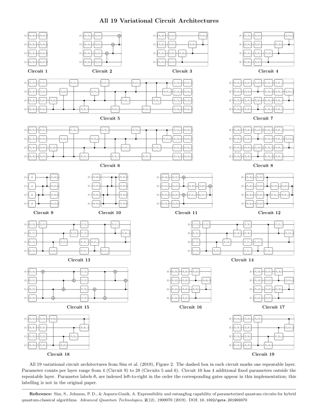

# Parametrized Quantum Circuit for HEP Binary Classification

**Author:** Adriano Pinto Claro da Fonseca  
**Email:** apcf@topfonseca.com  
**Institutional email:** adriano.fonseca@tecnico.ulisboa.pt  
**Affiliation:** Student at Instituto Superior Técnico, Universidade de Lisboa  
**Supervisor:** Pedrame Bargassa, Ruđer Bošković Institute (RBI)

---

## Overview

This repository implements a **Parametrized Quantum Circuit (PQC)** binary classifier for
high-energy physics (HEP) event classification — distinguishing signal from background events
using 12 input features per event. Training is performed on classical hardware (or optionally
on real quantum hardware) via mini-batch gradient descent, with quantum circuit gradients
computed exactly using the parameter shift rule.

Four implementations are provided across two quantum computing frameworks:

| Implementation | Framework | Embedding method | Real hardware |
|---|---|---|---|
| **Qiskit** *(primary)* | Qiskit [[6]](#ref-6) / IBM | `StatePreparation` | ✓ IBM Quantum (via `IBM_BACKEND`) |
| Gram-Schmidt | PyQuil [[8]](#ref-8) / Rigetti | Custom 16×16 unitary (Gram-Schmidt) | ✗ |
| QR decomposition | PyQuil [[8]](#ref-8) / Rigetti | Custom 16×16 unitary (QR) | ✗ |
| Pytket [[7]](#ref-7) | PyQuil [[8]](#ref-8) / Rigetti | Qiskit → Pytket → PyQuil (native gates) | ✓ Rigetti QPU (via `QUANTUM_COMPUTER`) |

---

## Repository Structure

```
PQC_HEP_Code/
│
├── README.md                                    ← this file
│
├── Qiskit implementation/
│   ├── PQC_HEP_training_file_Qiskit.py          ← primary training script
│   └── circuits_library_Qiskit.py               ← 19 variational form circuits (Qiskit)
│
└── Pyquil implementations/
    ├── circuits_library_PyQuil.py               ← 19 variational form circuits (PyQuil)
    ├── Gram-Schmidt implementation/
    │   └── PQC_HEP_training_file_Gram-Schmidt.py
    ├── QR implementation/
    │   └── PQC_HEP_training_file_QR.py
    └── Pytket implementation/
        └── PQC_HEP_training_file_pytket.py
```

The data files (`train_sig.csv`, `train_bkg.csv`) are expected in a `Data/` folder at the
same level as the implementation folders, or the path can be configured in USER SETTINGS.

---

## Why Qiskit is the Primary Implementation

The Qiskit implementation is recommended as the main version for the following reasons:

1. **Exact simulation mode (`USE_STATEVECTOR=True`)**: Qiskit's `AerSimulator` and the
   `Statevector` class allow exact, deterministic computation of P(|1⟩) without shot noise.
   This gives perfectly clean gradient estimates and smooth, reproducible loss curves — ideal
   for studying convergence behaviour.

2. **Real IBM Quantum hardware support**: By setting `IBM_BACKEND` to an IBM QPU name
   (e.g. `"ibm_brisbane"`), the same code can run on real quantum hardware without
   modification. Qiskit's `StatePreparation` gate is natively supported and can be
   transpiled to hardware-native gate sets.

3. **Computational efficiency**: AerSimulator supports parallel multi-circuit evaluation via
   `max_parallel_experiments=0`, exploiting all available CPU cores. The training loop submits
   entire batches of circuits in a single `backend.run()` call, eliminating per-circuit
   Python overhead.

4. **Ecosystem maturity**: Qiskit [[6]](#ref-6) is the most actively developed and widely used quantum
   computing framework, with extensive documentation, hardware support, and community resources.

---

## Why the PyQuil Implementations Are Included

The three PyQuil implementations are included for the following reasons:

1. **Exploration of amplitude embedding strategies**: The Gram-Schmidt and QR implementations
   construct the amplitude embedding as an explicit 16×16 unitary matrix. These were developed
   to explore whether the choice of unitary construction method affects training behaviour,
   providing a direct comparison against the Qiskit StatePreparation approach.

2. **Cross-framework portability**: The Pytket [[7]](#ref-7) implementation demonstrates that the same PQC
   algorithm can be expressed across multiple quantum computing frameworks by using
   Pytket as a transpilation layer (Qiskit → Pytket → PyQuil [[8]](#ref-8)), rebasing the embedding
   to native Rigetti gates {Rx, Rz, CZ}.

3. **Rigetti hardware support (Pytket only)**: The Pytket implementation can run on real
   Rigetti quantum hardware by changing the `QUANTUM_COMPUTER` setting to a QPU name (e.g.
   `"Ankaa-2"`), since the native-gate rebase makes the circuit hardware-compatible.

4. **Completeness and future development**: All four implementations share the same
   mathematical framework (identical loss function, weight normalisation, parameter shift
   rule, and Adam optimiser). They are included for completeness and may serve as a starting
   point for future comparisons across quantum hardware providers.

> **Note:** The Gram-Schmidt and QR implementations use a custom `DefGate` to apply the
> 16×16 embedding unitary. This construct is only supported by the PyQuil QVM simulator
> and cannot be executed on real quantum hardware without additional native-gate decomposition.

---

## Algorithm

### Circuit architecture

Each circuit consists of two parts applied sequentially to a 4-qubit register:

1. **Amplitude embedding**: The 12 input features are zero-padded to 16 dimensions and
   normalised to unit L2 norm, encoding them as the amplitudes of a quantum state |ψ⟩.
2. **Variational form W(θ)**: A parameterised circuit of rotation gates (Rx, Ry, Rz and
   optionally CRx, CRy, CRz) with trainable parameters θ. 19 circuit templates are available,
   numbered following Figure 2 of Sim et al. (2019) [[5]](#ref-5).

The classifier output is the measurement probability P(qubit 0 = |1⟩).

### Training pipeline

Training uses **mini-batch gradient descent** with one Adam optimiser step per batch:

1. Forward pass: evaluate P(|1⟩) for all events in the batch at the current θ.
2. Batch loss: weighted binary cross-entropy over the current batch $K$:

$$L_K = -\frac{1}{N_K} \sum_{i \in K} w_i \left[ z_i \ln y_i + (1 - z_i) \ln(1 - y_i) \right]$$

where $K$ is the current batch, $N_K = B$ is the batch size, $z_i \in \{0,1\}$ is the true label (1 for signal, 0 for background), and $w_i$ are the normalised event weights (see [Weight normalisation](#weight-normalisation) below).

3. Gradient: computed exactly via the **parameter shift rule**, where $f(\boldsymbol{\theta}) \equiv y_i(\boldsymbol{\theta}) = P_0(|1\rangle)$ is the circuit output for event $i$ at parameters $\boldsymbol{\theta}$ (the quantity evaluated in step 1):
   - **Two-term rule** for Rx(θ), Ry(θ), Rz(θ) (generator eigenvalues {+1, −1}) (see [[1]](#ref-1), [[2]](#ref-2)):

$$\frac{\partial f}{\partial \theta_k} = \frac{f(\theta + \tfrac{\pi}{2} e_k) - f(\theta - \tfrac{\pi}{2} e_k)}{2}$$

   - **Four-term rule** for CRx(θ), CRy(θ), CRz(θ) (generator eigenvalues {−1, 0, +1}) (see [[3]](#ref-3)):

$$\frac{\partial f}{\partial \theta_k} = d_1 \left[ f(\theta + \tfrac{\pi}{2} e_k) - f(\theta - \tfrac{\pi}{2} e_k) \right] - d_2 \left[ f(\theta + \pi e_k) - f(\theta - \pi e_k) \right]$$

where $d_1 = \tfrac{1}{2}$, $d_2 = \tfrac{\sqrt{2}-1}{4}$ (Anselmetti et al. 2021, Appendix F.2, Eq. F15). These rules give the mathematically exact gradient $\partial y_i/\partial\theta_k$ with no finite-difference approximation.

   The batch gradient of the loss then follows from the **chain rule**:

$$\frac{\partial L_K}{\partial \theta_k} = -\frac{1}{N_K} \sum_{i \in K} w_i \frac{z_i - y_i}{y_i(1-y_i)}\,\frac{\partial y_i}{\partial \theta_k}$$

   where $\partial y_i/\partial\theta_k$ is the shift-rule result above.

4. Optimiser update: **Adam** [[4]](#ref-4) (Kingma & Ba 2014, standard constant-β₁/β₂ formulation,
   implemented via `sklearn.neural_network._stochastic_optimizers.AdamOptimizer`).

### Weight normalisation

Physics event weights are normalised after event selection so that the total signal weight
equals the total background weight:

$$w_i^{(S)} \leftarrow w_i^{(S)} \cdot \frac{N_{\text{bkg}}}{\sum_j w_j^{(S)}}, \qquad
  w_i^{(B)} \leftarrow w_i^{(B)} \cdot \frac{N_{\text{bkg}}}{\sum_j w_j^{(B)}}$$

where $N_{\text{bkg}}$ is the number of background events in the selected training set.
Normalisation is applied after event selection so that the balance reflects the actual
training data, regardless of the `MAX_EVENTS` or `BALANCE_CLASSES` settings.

### Gate classification

Before training begins, each parameter θₖ is automatically classified by the gate type it
feeds, and the correct gradient rule is applied per parameter. An unrecognised gate type
raises a `ValueError` immediately — there is no silent failure.

### Simulation modes (Qiskit only)

The Qiskit implementation supports two simulation modes controlled by `USE_STATEVECTOR`:

- **`USE_STATEVECTOR = True`**: Computes P(|1⟩) exactly using the full quantum state vector.
  No measurement shot noise — gradients are exact and training curves are perfectly smooth.
  Recommended for studying convergence behaviour and producing clean loss curves.

- **`USE_STATEVECTOR = False`**: Estimates P(|1⟩) from `Nm` measurement shots.
  Introduces statistical shot noise in each gradient estimate, simulating what would occur
  on real quantum hardware. Set `Nm ≥ 1000` for reasonable gradient estimates.

---

## Circuit reference

<details>
<summary><b>All 19 variational circuit architectures — click to expand</b></summary>

<picture>
  <source media="(prefers-color-scheme: dark)" srcset="circuits_dark.svg">
  
</picture>

</details>

---

## Requirements

### Qiskit implementation

```
Python >= 3.9
qiskit
qiskit-aer
scikit-learn
numpy
tqdm
```

Optional (for real IBM hardware):
```
qiskit-ibm-runtime
```

### PyQuil implementations

```
Python >= 3.9
pyquil
scikit-learn
numpy
scipy
tqdm
Docker  (to run the QVM and Quilc containers)
```

Additional dependency for the Pytket implementation:
```
pytket
pytket-qiskit
```

### Data files

The training data files must be CSV files with one event per line:

```
col 0–11 : 12 floating-point feature values
col 12   : event weight (float)
col 13   : process name (string, ignored during training)
```

---

## Installation

Clone the repository and install dependencies:

```bash
# Qiskit implementation
pip install qiskit qiskit-aer scikit-learn numpy tqdm

# PyQuil implementations (in addition)
pip install pyquil

# Pytket implementation (in addition)
pip install pytket pytket-qiskit

# Optional: real IBM hardware
pip install qiskit-ibm-runtime
```

### Starting the PyQuil QVM (required for all PyQuil implementations)

The PyQuil implementations require the Rigetti QVM simulator and Quilc compiler to be
running as Docker containers before training is started. The port numbers must match the
`QVM_PORT` and `QUILC_PORT` settings in USER SETTINGS (defaults: 5001 and 5555).

```bash
docker run --rm -p 5001:5000   rigetti/qvm   -S
docker run --rm -p 5555:5555   rigetti/quilc -R
```

---

## Usage

All hyperparameters are controlled via the **USER SETTINGS** section at the top of each
training file. No other section of the file needs to be modified between runs.

### Running the Qiskit implementation

```bash
cd "Qiskit implementation"
python3 PQC_HEP_training_file_Qiskit.py
```

Command-line arguments are also available and override USER SETTINGS:

```bash
python3 PQC_HEP_training_file_Qiskit.py \
    --circuit-number 2 \
    --n-layers 1 \
    --n-iter 100 \
    --batch-size 100 \
    --max-events 2000
```

### Running the PyQuil implementations

```bash
# Gram-Schmidt
cd "Pyquil implementations/Gram-Schmidt implementation"
python3 PQC_HEP_training_file_Gram-Schmidt.py

# QR decomposition
cd "Pyquil implementations/QR implementation"
python3 PQC_HEP_training_file_QR.py

# Pytket
cd "Pyquil implementations/Pytket implementation"
python3 PQC_HEP_training_file_pytket.py
```

---

## Troubleshooting

### PyQuil implementations: QVM connection error

If training fails with a connection error, the QVM or Quilc container is not running.
Check with `docker ps` and restart if needed using the commands in the Installation section.
If ports 5001 or 5555 are already in use on your system, change the `-p` mapping in the
`docker run` command **and** update `QVM_PORT` / `QUILC_PORT` in USER SETTINGS to match.

### Qiskit: IBM hardware

If `IBM_BACKEND` is set, `qiskit-ibm-runtime` must be installed and a valid `IBM_TOKEN`
must be provided. Setting `IBM_BACKEND = None` always uses local simulation with no account
required.

---

## Key USER SETTINGS

The following settings have the most significant impact on training. All settings are
documented in full detail within each training file.

| Setting | Description |
|---|---|
| `CIRCUIT_NUMBER` | Variational form template (1–19, see circuit selection below) |
| `N_LAYERS` | Number of variational block repetitions per pass |
| `MAX_EVENTS` | Total training events; `None` uses all available |
| `BALANCE_CLASSES` | Use equal signal and background event counts; no effect when `MAX_EVENTS=None` |
| `N_ITER` | Full passes over all training events (epochs) |
| `BATCH_SIZE` | Events per mini-batch gradient update |
| `ALPHA` | Adam learning rate |
| `USE_STATEVECTOR` | Exact P(\|1⟩) without shot noise — Qiskit only |
| `Nm` | Shots per evaluation when `USE_STATEVECTOR=False` — Qiskit only |
| `GLOBAL_EVAL_STEP` | Evaluate global loss every N passes |
| `RUN_TAG` | Optional string prepended to the output folder name |

### Selecting a circuit

Circuits 1–19 are numbered following Figure 2 of Sim et al. (2019) [[5]](#ref-5). All circuits use 4
qubits and between 4 and 28 trainable parameters per layer application. Key properties:

- **Circuits 1, 2, 9–12, 15**: Only Rx/Ry/Rz gates — all parameters use the two-term rule.
- **Circuits 3–8, 13–14, 16–19**: Include CRx/CRy/CRz gates — some parameters use the
  four-term rule.

---

## Outputs

Each run creates a timestamped output folder:

```
[RUN_TAG_]circuit{N}_layers{L}_{iter}iter_batch{B}_{YYYY-MM-DD_HH-MM-SS}/
├── results.json     ← full training record (all settings, loss history, final θ)
└── classifier.py   ← standalone classifier with trained parameters baked in
```

The `results.json` file records all USER SETTINGS, the loss at each checkpoint, and
`theta_final` (the trained parameter vector). It can be loaded with Python's `json.load()`.

The `classifier.py` file is a self-contained script that applies the trained circuit to new
events without requiring the training file. It supports two modes:

- **Single event** (default): edit `your_event_features` inside the file and run it directly.
- **Batch CSV**: pass a data file as a command-line argument to classify every event in it:
  ```bash
  python classifier.py path/to/events.csv
  ```
  The CSV must have the same column format as the training data (col 0–11: features; col 12+: ignored).
  One result line is printed per event.

---

## Cite this work

If you use this code, please cite it as:

**APA:**
Fonseca, A. (2026). *PQC-HEP-Binary_Classification* (Version 1.0.0) [Computer software]. https://github.com/APCF-git/PQC-HEP-Binary_Classification

**BibTeX:**
```bibtex
@software{fonseca2026pqchep,
  author  = {Fonseca, Adriano},
  title   = {PQC-HEP-Binary\_Classification},
  year    = {2026},
  version = {1.0.0},
  url     = {https://github.com/APCF-git/PQC-HEP-Binary\_Classification},
  license = {MIT}
}
```

You can also use the **"Cite this repository"** button in the GitHub sidebar (generated automatically from `CITATION.cff`).

---

## References

<a id="ref-1"></a>
**1.** **Mitarai, K., Negoro, M., Kitagawa, M., & Fujii, K. (2018).**
   Quantum circuit learning.
   *Physical Review A*, 98, 032309.
   [arXiv:1803.00745](https://arxiv.org/abs/1803.00745)
   — *Two-term parameter shift rule for exact quantum gradients; used in
   `compute_batch_gradient_and_loss` for Rx/Ry/Rz gates in all four implementations.*

<a id="ref-2"></a>
**2.** **Schuld, M., Bergholm, V., Gogolin, C., Izaac, J., & Killoran, N. (2019).**
   Evaluating analytic gradients on quantum hardware.
   *Physical Review A*, 99, 032331.
   [arXiv:1811.11184](https://arxiv.org/abs/1811.11184)
   — *Proof of exactness of the two-term parameter shift rule for gates of the form
   exp(−iθ/2·P) where P is a Pauli operator.*

<a id="ref-3"></a>
**3.** **Anselmetti, G.-L. R., Wierichs, D., Gogolin, C., & Parrish, R. M. (2021).**
   Local, expressive, quantum-number-preserving VQE ansätze for fermionic systems.
   *New Journal of Physics*, 23, 113010.
   [arXiv:2104.05695](https://arxiv.org/abs/2104.05695)
   — *Four-term parameter shift rule for controlled-Pauli-rotation gates with generator
   eigenvalues {−1, 0, +1} (Appendix F.2, Eq. F15); used for CRx/CRy/CRz gates.*

<a id="ref-4"></a>
**4.** **Kingma, D. P., & Ba, J. (2014).**
   Adam: A method for stochastic optimization.
   [arXiv:1412.6980](https://arxiv.org/abs/1412.6980)
   — *Standard Adam optimiser (constant-β₁/β₂ formulation); the specific
   implementation used is `sklearn.neural_network._stochastic_optimizers.AdamOptimizer`
   in all four training files.*

<a id="ref-5"></a>
**5.** **Sim, S., Johnson, P. D., & Aspuru-Guzik, A. (2019).**
   Expressibility and entangling capability of parameterized quantum circuits
   for hybrid quantum-classical algorithms.
   *Advanced Quantum Technologies*, 2(12), 1900070.
   [DOI: 10.1002/qute.201900070](https://doi.org/10.1002/qute.201900070)
   — *Circuit templates 1–19 in `circuits_library_Qiskit.py` and
   `circuits_library_PyQuil.py` follow Figure 2 of this work.*

<a id="ref-6"></a>
**6.** **Qiskit contributors (2023).**
   Qiskit: An open-source framework for quantum computing.
   [DOI: 10.5281/zenodo.2573505](https://doi.org/10.5281/zenodo.2573505) (accessed 2026)
   — *Quantum computing framework used by the primary Qiskit implementation
   (`qiskit`, `qiskit-aer`). The Zenodo record reflects the last archived version (2023);
   the framework was used in its current 2026 release.*

<a id="ref-7"></a>
**7.** **Sivarajah, S., Dilkes, S., Cowtan, A., Sherwood, W., Misra, A., & Duncan, R. (2021).**
   t|ket⟩: a retargetable compiler for NISQ devices.
   *Quantum Science and Technology*, 6(1), 014003.
   [DOI: 10.1088/2058-9565/ab8e92](https://doi.org/10.1088/2058-9565/ab8e92)
   — *Pytket is used in the Pytket implementation as the transpilation layer
   (Qiskit → Pytket → PyQuil), rebasing the amplitude embedding to native
   Rigetti gates {Rx, Rz, CZ}.*

<a id="ref-8"></a>
**8.** **Smith, R. S., Curtis, M. J., & Zeng, W. J. (2017).**
   A practical quantum instruction set architecture.
   [arXiv:1608.03355](https://arxiv.org/abs/1608.03355)
   — *Describes the Quil quantum instruction language, the basis of the PyQuil
   framework used in the Gram-Schmidt, QR, and Pytket implementations.*

